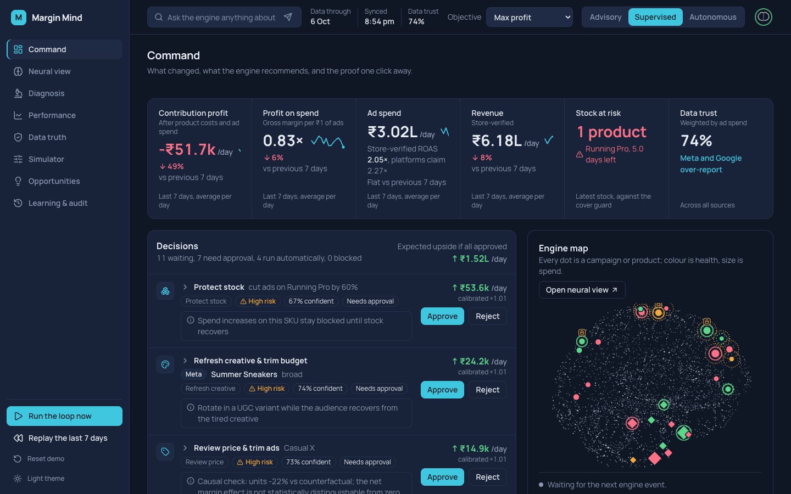
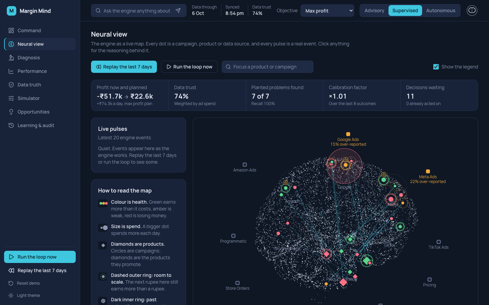
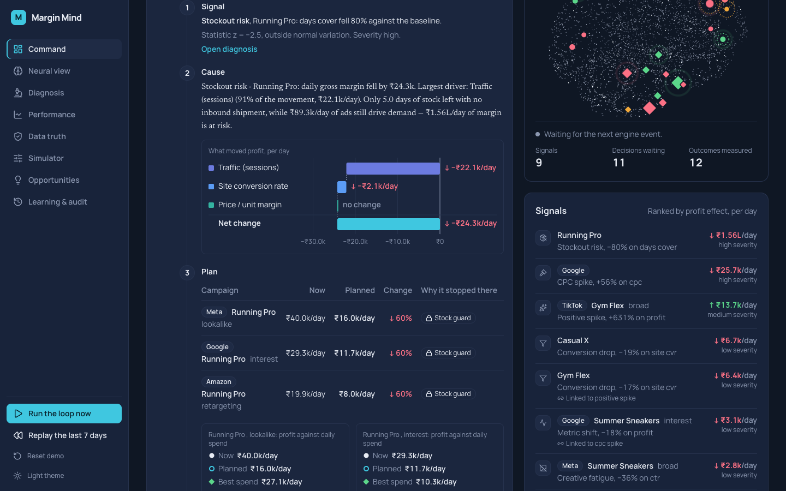
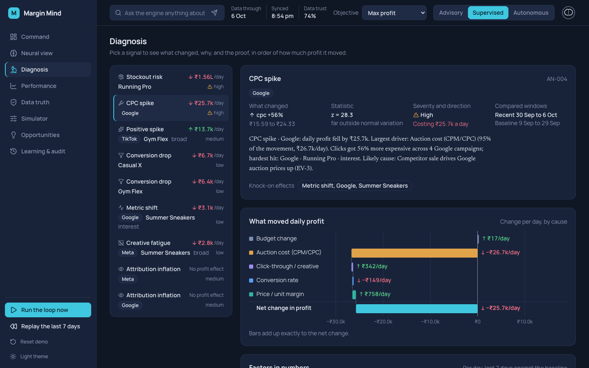
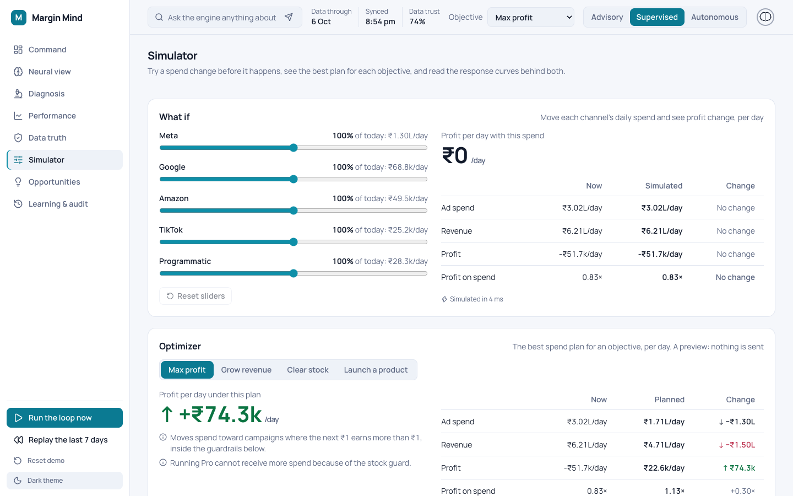

# Margin Mind: the dashboard

The front end of the DataQuest 3.0 decision engine. Decisions first, proof one click away: every number on every screen comes from the engine's API and is labelled with its period (per day, last 7 days).



## Run it

You need the backend on port 8000. Either server serves the same routes and the same JSON:

```bash
# from the repository root
.venv/bin/uvicorn backend.api.main:app --port 8000          # FastAPI, docs at /docs
.venv/bin/python -m backend.api.devserver --port 8000       # the zero-dependency fallback
```

Then the dashboard:

```bash
cd frontend
npm install
npm run dev          # http://localhost:3000   (NEXT_PUBLIC_API_URL defaults to http://localhost:8000)
```

If the engine is not reachable the app shows a banner with a Retry button instead of breaking.

| Command | What it does |
|---|---|
| `npm run dev` | development server |
| `npm run build` then `npx next start -p 3100` | production build (used by the end-to-end tests) |
| `npm run lint` | ESLint, including the React 19 rules |
| `npm test` | 41 unit tests (formatting, names, layout, decision logic, thresholds) |
| `npm run e2e` | the mouse-only demo flow in Chrome against the running backend and `:3100` |
| `npx playwright test -c e2e/playwright.config.ts e2e/a11y.spec.ts` | axe accessibility scan, both themes, every page |
| `node e2e/capture.mjs` | re-captures every page at 1440 and 900 wide in both themes |

After CSS edits to `app/globals.css` restart the dev server; in this setup it does not recompile that file on change.

## Routes and what each screen shows

| Route | What it shows |
|---|---|
| `/command` | The P&L strip (profit, profit on spend, ad spend with store-verified against claimed ROAS, revenue, stock at risk, data trust), the decision ledger with a 7-step trace per decision, the live Engine map, ranked signals, and the loop timeline |
| `/neural` | The whole engine as a live map: campaigns, products, data sources, untested ideas and the memory between them, with a live pulse feed, a legend, and a details drawer |
| `/diagnosis` | Why a signal happened: brief, waterfall of causes, factor table, evidence charts, causal proof, funnel, and the matching decision |
| `/performance` | Channels, campaigns and products as sortable tables, with response curves and stock cover |
| `/data` | Sources, platform claims against the store, data quality checks, and the engine's thresholds in plain words |
| `/simulator` | What-if sliders per channel, the optimizer per objective, and every response curve |
| `/opportunities` | Untested product, channel and audience combinations, ranked, with a launch-test decision each |
| `/learning` | Forecast error, calibration, predicted against actual, what the brain remembers, and the audit log with rollback |

### Where every factor the engine computes is visible

| The engine computes | Where you see it |
|---|---|
| Ingestion, reconciliation, source trust, data quality | `/data` (all four sections); data trust in the Command strip; source nodes on `/neural` |
| Platform against store-verified ROAS, over-reporting | Command strip; `/performance` Channels; `/data` reconciliation; trust rings on `/neural` |
| Anomaly detection (z-score, minimum change, windows, severity) | Signals on `/command`; `/diagnosis` brief and list; alert pulses on `/neural`; thresholds on `/data` |
| Root cause (7-factor waterfall, factor shares) | `/diagnosis` waterfall and factor table; trace step 2; neural drawer |
| Funnel (GA4 stages and step rates) | `/diagnosis`; `/performance` Products |
| Causal proof (synthetic control, interval, controls) | `/diagnosis` for price-change anomalies; decision trace for price reviews |
| Budget optimizer (objectives, bounds, solver) | `/simulator` optimizer; planned change in `/performance` Campaigns and on `/neural` hover cards |
| Response curves (Hill fit, marginal POAS, saturation, headroom) | `/simulator` curves; `/performance` row detail; trace step 3; headroom halos on `/neural` |
| What-if simulation and stock warnings | `/simulator` what-if |
| Opportunity model (ridge, held-out R², stock factor, test budget) | `/opportunities`; ghost nodes on `/neural` |
| Decision engine (priority, risk, approval tier, blocked) | The ledger on `/command`; compact rows in `/diagnosis`, `/opportunities` and the neural drawer |
| Guardrails (daily cap, stock guard, auto-apply limit, hard block) | Trace step 4; `/data` thresholds; limits listed under the optimizer |
| Confidence (signal strength, curve uncertainty, forecast error) | Trace step 5 |
| Calibration (factor, raw against calibrated impact) | Trace step 6; `/learning` strip |
| Execution, API calls, audit, rollback | Toasts; `/learning` audit log with each API call and Roll back |
| Closed-loop learning (outcomes, forecast error, synapse memory) | `/learning`; line thickness on `/neural` |
| The AI agent (Claude or the rules engine, with traceable numbers) | The Ask bar on every page, with highlights on the map |
| The continuous loop (steps, events, next run) | Loop timeline on `/command`; the status orb in the top bar |

## Design principles

The full contract is [DESIGN.md](DESIGN.md). In short:

- **A neuro-lab for your P&L.** Calm and clinical; neural activity is the one vivid element. Machine numbers are in Manrope, the engine's own reasoning is in Newsreader.
- **Colour means something.** Gain, loss and risk only, always with an icon or a word. The accent colour is for engine activity and primary actions.
- **Structure over cards.** One P&L strip, ledger rows that expand, real tables.
- **Names are structured**, never dotted strings. Money and ratios go through `lib/format.ts`, which matches the backend's formatter.
- **Motion answers actions.** The only choreographed moment is the intro. Brain pulses play real events only.
- **Both themes pass WCAG AA** (checked with axe on every page), keyboard focus is always visible, and every chart has a written summary.

## The demo script

Reset first (`Reset demo` in the left rail, or `POST /demo/reset`). Say what the screen shows; the numbers come from the live UI.

1. **Intro, then Command.** We are losing money on ads (the profit cell is red), and the platforms over-claim ROAS (the ad spend cell shows store-verified against claimed).
2. **Engine map.** The brain already shows Running Pro locked by the stock guard and Summer Sneakers fading.
3. **Top decision.** Expand the trace: signal, cause, plan, guardrails, confidence. Approve. Open the audit to see the API calls and the measured outcome.
4. **Diagnosis.** The Google CPC spike (auction cost is the biggest bar); the Casual X price change and its causal proof.
5. **Neural view.** Replay the last 7 days. Click the Trail Max ghost and launch the test.
6. **Simulator.** Max profit, before and after. Move Google to 120% and watch profit fall.
7. **Data truth.** Store-verified against claimed ROAS; the guardrails panel.
8. **Learning.** Forecast error falling; the audit log with a rollback.
9. **Ask.** "Why did Summer Sneakers drop?" and follow the highlight to the map.

## Screenshots

Captured by `node e2e/capture.mjs` into `e2e/screenshots/review/` (`<page>-<width>-<theme>.png`, widths 1440 and 900), and by the end-to-end test into `e2e/screenshots/` (one per demo step).

| Neural view | Decision trace |
|---|---|
|  |  |
|  |  |

## Architecture notes

- `lib/api.ts` is the only code that talks to the engine; `lib/queries.ts` wraps it in TanStack Query hooks and `invalidateAfterAction` refreshes every view an action can change.
- `lib/brain/` is the shared brain engine: a deterministic layout, an event store, and a player that polls `/brain/events` every 2 s into a queue and plays one event at a time. The compact Engine map and the full neural view both use it.
- Charts are plain SVG in `components/charts/`. The brain is a WebGL dot cloud with SVG items on top, so hover, focus and click stay crisp and accessible. Without WebGL (or below 768px) the same items draw on a flat map.
- Query results report "pending" until the page has hydrated, so server-rendered skeletons always match the first client render.

## What the API does not expose

Reported while building the screens (the backend was not changed): a reason for a blocked decision; the weights of the synthetic control; per-fold R² of the opportunity model; product price and units per day (only for products with an open diagnosis); paid against organic orders; a daily history per campaign; the confidence level of the causal interval (95% is assumed from the method).
